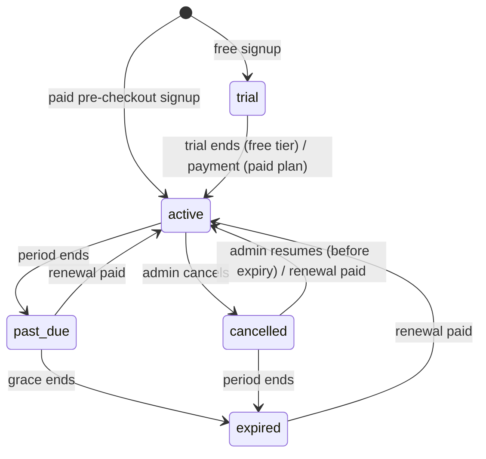

# Billing and Subscription Lifecycle

This document is the reference for how a cooperative's subscription moves
through its lifecycle and how the backend decides which plan is currently in
force. The implementation lives in
`backend/app/services/subscription_lifecycle.py`; the plan catalogue and
prices live in `backend/app/services/plans.py`; payment intents in
`backend/app/services/subscription_service.py`.

## Fields on `cooperatives`

| Column | Meaning |
|---|---|
| `subscription_plan` | Plan key on record: `starter`, `solo`, `growth`, `enterprise`. For a trial this stays `starter` (nothing has been bought). |
| `subscription_band` | Optional size band within the plan (`w20`/`w50`/`w100` for Solo, `base`/`plus_50`/`plus_100` for Growth). |
| `subscription_status` | Lifecycle state, see below. |
| `subscription_expires_at` | End of the current trial or paid period. `NULL` on the free tier. |

## States

| Status | Meaning | Effective plan |
|---|---|---|
| `trial` | 14-day Growth trial started at free signup. | `growth` until `subscription_expires_at`, then the account drops to the free tier. |
| `active` | Free tier (`starter`, no expiry) **or** paid plan inside its 30-day period. | `subscription_plan` |
| `past_due` | Paid period ended; 7-day grace period in which access continues so a late renewal does not interrupt operations. | `subscription_plan` while in grace |
| `expired` | Grace period ended without payment. | `starter` (the paid plan remains on record so a renewal restores it) |
| `cancelled` | Admin cancelled; access continues until `subscription_expires_at`, then `expired`. | `subscription_plan` until expiry, then `starter` |

Constants: `TRIAL_DAYS = 14`, `PERIOD_DAYS = 30`, `GRACE_DAYS = 7`.

## Transitions

Time-based transitions (`trial → active`, `active → past_due`,
`past_due → expired`, `cancelled → expired`) are applied lazily by
`reconcile()`; there is no scheduler. `reconcile` runs at every point where
entitlements are checked (member creation, SMS broadcast, `GET
/subscriptions/status`, `require_active_subscription`) and is idempotent.
`effective_plan_key()` is also safe to call on an un-reconciled row: it
computes the entitlement plan from the timestamps, so a cooperative whose
status column still says `active` but whose grace period has passed is
already enforced at the free tier.

Payment-driven transitions (`→ active`) go through `renew()` and are only
reachable from a verified payment intent (see below). Renewal while a period
is still running **extends from the current expiry**; renewal after a lapse
(or from a trial, or when the plan changes) starts a fresh 30-day period from
now.

## Renewal, upgrade, cancel, downgrade

| Action | Who | How | Effect |
|---|---|---|---|
| Upgrade / change plan | Admin | `POST /subscriptions/checkout` → pay → webhook | `renew(plan, band)`: same plan extends the period; a different plan starts a new one. |
| Renew current plan | Admin | `POST /subscriptions/renew` → pay → webhook | Same as upgrade with the plan/band already on record. Rejected (400) on the free tier or during a trial. |
| Cancel at period end | Admin | `POST /subscriptions/cancel` | `active → cancelled`; paid access continues until expiry, then free tier. |
| Cancel immediately | Admin | `POST /subscriptions/cancel` with `{"immediately": true}` | Drop to the free tier now; no refund logic is implied. |
| Resume | Admin | `POST /subscriptions/resume` | `cancelled → active` if the period has not ended (409 otherwise). |
| Downgrade Growth → Starter | Admin | `PATCH /cooperatives/{id}` with `subscription_plan: "starter"` | Immediate; clears band and expiry. |
| Trial end | System | `reconcile` | Free tier, no expiry. |

Every activation, whether first purchase, upgrade, or renewal, is backed by a
`PendingCheckout` intent whose amount is verified against the provider's paid
amount before `renew()` is called. Duplicate webhook deliveries are ignored
after the first activation, so a period is never extended twice for one
payment.

## Enforcement

Route handlers should never read `cooperative.subscription_plan` directly for
gating. Use:

- `lifecycle.reconcile_and_commit(db, coop)` then
  `lifecycle.effective_plan_key(coop)` for plan limits (`get_plan_limit`) and
  features (`has_feature`);
- `Depends(lifecycle.require_active_subscription("feature"))` on routes that
  require a live paid plan. It responds `402 Payment Required` with
  `{"code": "subscription_required", "status": ..., "effective_plan_key": ...}`
  and is a no-op when authentication is disabled or the user has no
  cooperative.

`GET /subscriptions/status` returns the same `SubscriptionState` view the
dependency uses (`status`, `plan_key`, `band`, `effective_plan_key`,
`paid_access`, `in_grace`, `days_remaining`, `expires_at`, `trial_days`,
`grace_days`) for the Settings billing panel.

## Related

- `docs/api-contract.md` → "Subscriptions and billing" (endpoints and
  intent verification)
- `docs/product-strategy.md` → plans and business model
- Issues: #235 (payment intents), #234 (lifecycle), #233 (entitlements), #236
  (billing portal UI), #237 (organizations / consolidated billing)
