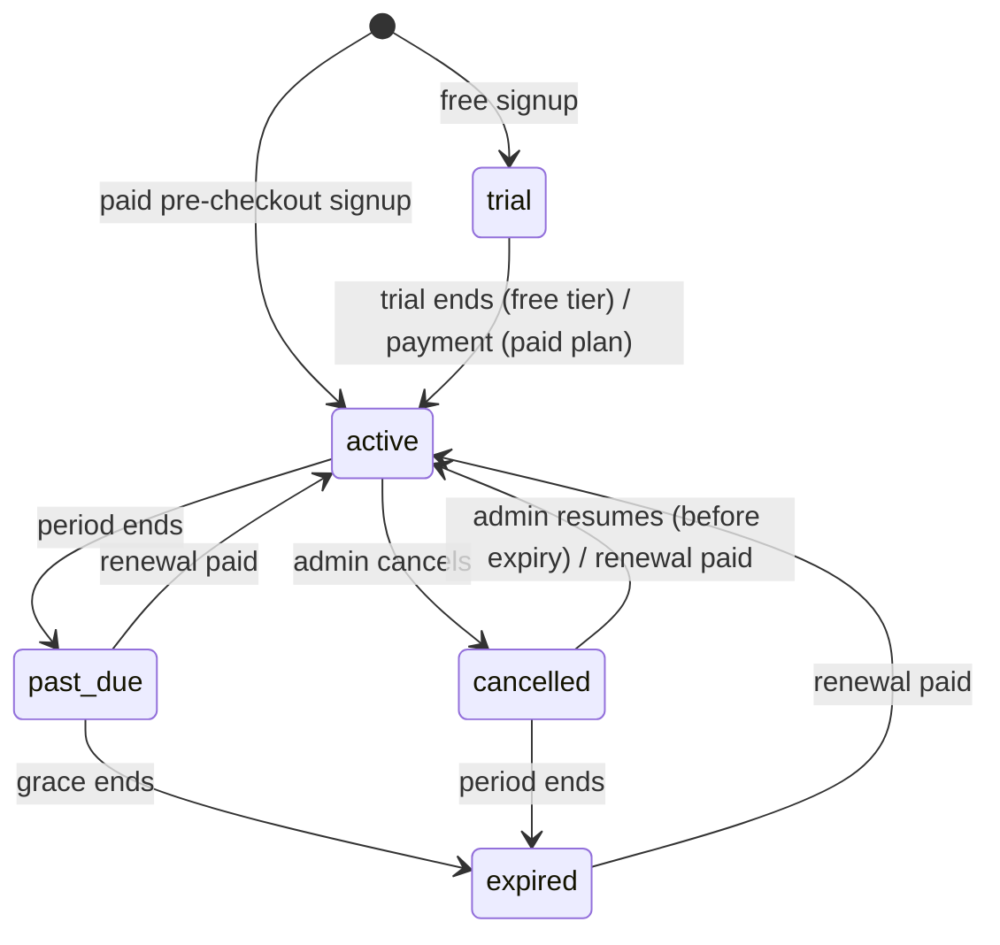

# Billing and Subscription Lifecycle

This document is the reference for how a cooperative's subscription moves
through its lifecycle and how the backend decides which plan is currently in
force. The implementation lives in
`backend/app/services/subscription_lifecycle.py`; the plan catalogue and
prices live in `backend/app/services/plans.py`; payment intents in
`backend/app/services/subscription_service.py`.

## Fields on `cooperatives`

| Column | Meaning |
|---|---|
| `subscription_plan` | Plan key on record: `starter`, `solo`, `growth`, `enterprise`. For a trial this stays `starter` (nothing has been bought). |
| `subscription_band` | Optional size band within the plan (`w20`/`w50`/`w100` for Solo, `base`/`plus_50`/`plus_100` for Growth). |
| `subscription_status` | Lifecycle state, see below. |
| `subscription_expires_at` | End of the current trial or paid period. `NULL` on the free tier. |

## States

| Status | Meaning | Effective plan |
|---|---|---|
| `trial` | 14-day Growth trial started at free signup. | `growth` until `subscription_expires_at`, then the account drops to the free tier. |
| `active` | Free tier (`starter`, no expiry) **or** paid plan inside its 30-day period. | `subscription_plan` |
| `past_due` | Paid period ended; 7-day grace period in which access continues so a late renewal does not interrupt operations. | `subscription_plan` while in grace |
| `expired` | Grace period ended without payment. | `starter` (the paid plan remains on record so a renewal restores it) |
| `cancelled` | Admin cancelled; access continues until `subscription_expires_at`, then `expired`. | `subscription_plan` until expiry, then `starter` |

Constants: `TRIAL_DAYS = 14`, `PERIOD_DAYS = 30`, `GRACE_DAYS = 7`.

## Transitions



Time-based transitions (`trial → active`, `active → past_due`,
`past_due → expired`, `cancelled → expired`) are applied lazily by
`reconcile()`; there is no scheduler. `reconcile` runs at every point where
entitlements are checked (member creation, SMS broadcast, `GET
/subscriptions/status`, `require_active_subscription`) and is idempotent.
`effective_plan_key()` is also safe to call on an un-reconciled row: it
computes the entitlement plan from the timestamps, so a cooperative whose
status column still says `active` but whose grace period has passed is
already enforced at the free tier.

Payment-driven transitions (`→ active`) go through `renew()` and are only
reachable from a verified payment intent (see below). Renewal while a period
is still running **extends from the current expiry**; renewal after a lapse
(or from a trial, or when the plan changes) starts a fresh 30-day period from
now.

## Renewal, upgrade, cancel, downgrade

| Action | Who | How | Effect |
|---|---|---|---|
| Upgrade / change plan | Admin | `POST /subscriptions/checkout` → pay → webhook | `renew(plan, band)`: same plan extends the period; a different plan starts a new one. |
| Renew current plan | Admin | `POST /subscriptions/renew` → pay → webhook | Same as upgrade with the plan/band already on record. Rejected (400) on the free tier or during a trial. |
| Cancel at period end | Admin | `POST /subscriptions/cancel` | `active → cancelled`; paid access continues until expiry, then free tier. |
| Cancel immediately | Admin | `POST /subscriptions/cancel` with `{"immediately": true}` | Drop to the free tier now; no refund logic is implied. |
| Resume | Admin | `POST /subscriptions/resume` | `cancelled → active` if the period has not ended (409 otherwise). |
| Downgrade Growth → Starter | Admin | `PATCH /cooperatives/{id}` with `subscription_plan: "starter"` | Immediate; clears band and expiry. |
| Trial end | System | `reconcile` | Free tier, no expiry. |

Every activation, whether first purchase, upgrade, or renewal, is backed by a
`PendingCheckout` intent whose amount is verified against the provider's paid
amount before `renew()` is called. Duplicate webhook deliveries are ignored
after the first activation, so a period is never extended twice for one
payment.

## Enforcement (entitlements)

Route handlers never read `cooperative.subscription_plan` directly for gating.
`backend/app/services/entitlements.py` is the single place that turns the
effective plan into decisions:

| Helper | Use |
|---|---|
| `assert_within_limit(db, coop, "max_members" \| "max_workers", current_count=None)` | Band-aware cap. Raises 403 `plan_limit_reached`; or `feature_not_in_plan` when the plan has no such module at all (Starter has no workers, Solo has no members). `0` means unlimited only when the module is included. |
| `assert_sms_quota(db, coop, recipients)` | Monthly quota on `sms_per_month`; resets the counter when the calendar month rolls over. Raises 403 `sms_quota_exceeded`. Returns the projected total to persist after a successful send. |
| `assert_feature(db, coop, "loans")` / `require_feature("loans")` | Feature flag from `feature_keys` in the catalogue. Raises 403 `feature_not_in_plan`. The dependency form is a no-op when auth is disabled (mirrors `require_roles`). |
| `require_active_subscription(feature=None)` (lifecycle) | 402 `subscription_required` when the caller has no live paid plan. |
| `usage_summary(db, coop)` | Payload for `GET /cooperatives/{id}/usage`. |

Every 403 from an entitlement gate carries a structured `detail`:

```json
{"code": "plan_limit_reached", "message": "Member limit of 10 reached for the starter plan. Upgrade to add more.",
 "plan": "starter", "limit_key": "max_members", "limit": 10, "used": 10}
```

The dashboard renders these through `UpgradePrompt` (message + link to the
billing panel) and shows usage bars from the usage endpoint in Settings.

### Band-aware limits

| Plan | Bands size | Members | Workers | SMS / month |
|---|---|---|---|---|
| Starter | — | 10 | module not included | 100 |
| Growth `base` / `plus_50` / `plus_100` | members | 50 / 100 / 200 | module not included | 1,000 |
| Solo `w20` / `w50` / `w100` / `custom` | workers | module not included | 20 / 50 / 100 / unlimited | 200 |
| Enterprise | — | unlimited | unlimited | 999,999 |
| Trial (free signup) | Growth default band | 50 | module not included | 1,000 |

A recorded band only applies while its plan is the effective plan; a lapsed
Growth `plus_100` cooperative is enforced at Starter's 10 members.

### Where gates are wired

| Surface | Gate |
|---|---|
| `POST /farmers/` (member create) | `assert_within_limit(..., "max_members")` |
| `POST /communications/sms/broadcast` | `assert_sms_quota` |
| `/loans/*` (router-level) | `require_feature("loans")` — AgroCredit is Growth+ |
| `/api/farmers`, `/api/agro-ai/*` (router-level) | `require_feature("scores")` |
| Farmer loan request via USSD / USSDK | `create_farmer_loan_request` checks `has_feature(effective_plan, "loans")` and ends the session with an explanatory message |
| `POST /workers/` cap and payroll feature | tracked in #260 (uses the same helpers) |

**Documented exception — member USSD menu.** The USSD menu itself (balance,
dues, announcements, link phone) is *not* gated on the `ussd` feature key even
though the pricing copy lists "USSD access" under Growth. Blocking it would
punish farmers for their cooperative's billing state, and the paid features
reachable from the menu (loan requests) are gated individually. Revisit when
the Starter tier's USSD scope is decided.

`GET /subscriptions/status` returns the `SubscriptionState` view the
lifecycle dependency uses (`status`, `plan_key`, `band`, `effective_plan_key`,
`paid_access`, `in_grace`, `days_remaining`, `expires_at`, `trial_days`,
`grace_days`) for the Settings billing panel.

## Billing portal (dashboard)

`frontend/src/components/dashboard/BillingPanel.jsx` is the admin-facing
portal inside Settings. It is entirely catalogue-driven — no plan key, price,
or limit is hardcoded — and composes four reads:

| Data | Endpoint |
|---|---|
| Plan catalogue (names, prices, bands, features, CTAs) | `GET /plans` |
| Lifecycle view (status, band, expiry, days remaining) | `GET /subscriptions/status` |
| Usage vs limits and feature flags | `GET /cooperatives/{id}/usage` |
| Payment history | `GET /subscriptions/history` |

Actions map 1:1 to the lifecycle table above: plan/band picker →
`POST /subscriptions/checkout` (same plan + band is disabled; use Renew),
Renew → `POST /subscriptions/renew`, Cancel (period end or immediately, with
an inline confirmation) → `POST /subscriptions/cancel`, Resume →
`POST /subscriptions/resume`, Downgrade to the free plan →
`PATCH /cooperatives/{id}`. The picker only offers purchasable plans on the
organisation's track (`cooperative` vs `farmer`); contracted plans
(Enterprise) link to the pricing page CTA.

Payment history is derived from `PendingCheckout` intents linked to the
cooperative: the pre-checkout intent that created the account plus every
upgrade/renewal since. `outcome` collapses the intent state machine
(`pending → paid → consumed`) to **Pending** / **Paid** for display; the raw
`status`, reference, and provider transaction id are kept for audit.

## Enterprise organizations (consolidated billing)

The Enterprise plan is contracted per **organization**, not per cooperative
(#237). An organization is a parent row (`organizations`) that groups member
cooperatives and carries the contract:

| Column | Meaning |
|---|---|
| `subscription_plan` | Always `enterprise` today |
| `subscription_status` | `pending` (created, no contract yet) → `active` → `expired` / `cancelled` |
| `subscription_expires_at` | Contract end; `NULL` = open-ended while `active` |
| `contract_reference` | Free-text reference to the signed agreement |

### Plan inheritance

`subscription_lifecycle.organization_plan_key(coop)` returns `enterprise`
while the parent contract is **live** (`status == active` and not past
`subscription_expires_at`). `effective_plan_key` checks this first, so every
member cooperative is enforced against Enterprise limits (`0 = unlimited`,
`feature_keys = ["all"]`) regardless of its own `subscription_plan`, and
`GET /cooperatives/{id}/usage` reports `inherits_organization_plan: true`.
When the contract lapses each cooperative falls back to its own plan and
lifecycle state — nothing is rewritten on the cooperative rows.

### Activation is an operator action

Contract state is never changed through the API (`PATCH /organizations/{id}`
only accepts profile fields). Operators run:

```bash
cd backend
python scripts/activate_enterprise.py --org 12 --months 12 --contract "MSA-2026-014"
python scripts/activate_enterprise.py --org 12 --cancel
```

`--months` sets `active` and extends `subscription_expires_at` from the later
of now or the current expiry; `--cancel` sets `cancelled`. Exit code `2` means
the organization id was not found.

### Consolidated view

`GET /organizations/{id}/billing` (organization admin) returns the contract
row, one row per member cooperative (own plan, effective plan, `inherits_organization_plan`,
members/workers/SMS meters from `entitlements.usage_summary`), totals across
the organization, and the payment history of every member cooperative's
intents. The dashboard renders this in Settings → **Organization**
(`OrganizationPanel.jsx`); the sidebar `OrganizationSwitcher` lets the admin
change active cooperative scope via `POST /organizations/{id}/switch`.

## Related

- `docs/api-contract.md` → "Subscriptions and billing" (endpoints and
  intent verification)
- `docs/product-strategy.md` → plans and business model
- Issues: #235 (payment intents), #234 (lifecycle), #233 (entitlements), #236
  (billing portal UI), #237 (organizations / consolidated billing)
